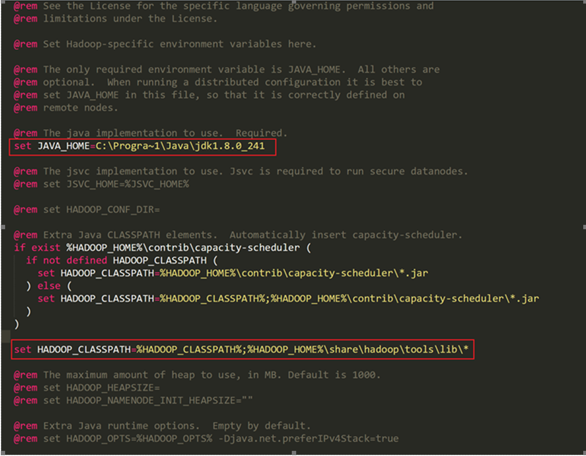

# Connect to Azure Data Lake Storage Gen 2 or WASB account

In this article, you learn how to connect to an Azure Data Lake Storage (ADLS) Gen 2 or Windows Azure Storage Blob (WASB) account through an instance of [.NET for Apache Spark](https://github.com/dotnet/spark) running locally on your Windows machine.

## Steps to setup the environment

1. Download the Apache Spark distribution built without Hadoop from [official website](https://archive.apache.org/dist/spark/) (choose a version [supported by .NET for Apache Spark](https://github.com/dotnet/spark#supported-apache-spark)), and extract it to a directory. Set the environment variable `SPARK_HOME` to this directory.
2. Download the Apache Hadoop binary from [here](http://hadoop.apache.org/releases.html) and extract to a folder, and set your `HADOOP_HOME` environment variable to this folder.
3. Download the `winutils.exe` and `hadoop.dll` files from [this location](https://github.com/cdarlint/winutils) (depending on the version of Hadoop installed in the previous step) and put them in the bin folder of your Hadoop. These binaries are needed on Windows in order to get everything setup correctly (this is explained in detail in the [Apache wiki here](https://cwiki.apache.org/confluence/display/HADOOP2/WindowsProblems)).
4. Configure your Hadoop installation by making the following changes to your `%HADOOP_HOME%\etc\hadoop\hadoop-env.cmd` file:
    1. Set the `JAVA_HOME` property using the DOS path (since Hadoop doesn't like spaces in `JAVA_HOME`). This should look something like this: `C:\Progra~1\Java\jdk1.8.0_241` (Pointing to whatever version of Java you have installed on your local machine).
    2. Append `%HADOOP_HOME%\share\hadoop\tools\lib\*` to `HADOOP_CLASSPATH`.
    Your final `hadoop-env.cmd` file should look something like this:

    

## Configure Hadoop to connect to your storage account

1. Open the ADLS Gen 2 or WASB storage account you want to connect to through the [Azure portal](https://portal.azure.com) and open the **Access keys** panel under the **Settings** blade and copy the value of **Key** from under key1.
2. Now in order to configure Hadoop to access your ADLS Gen2 account you would have to edit your `core-site.xml` (located in `%HADOOP_HOME%\etc\hadoop\` ) file which contains cluster-wide configuration. Add the following properties inside the `<configuration>` tags in this file:

    ```xml
    <configuration>
      <property>
        <name>fs.azure.account.auth.type.YOUR_ACCOUNT_NAME.dfs.core.windows.net</name>
        <value>SharedKey</value>
        <description></description>
      </property>
      <property>
        <name>fs.azure.account.key.YOUR_ACCOUNT_NAME.dfs.core.windows.net</name>
        <value>YOUR ACCESS KEY (copied from Step 1)</value>
        <description>The secret password. Never share these.</description>
      </property>
    </configuration>
    ```

    If you are trying to connect to a WASB account, replace `dfs` with `blob` in the 
    property names. For example, 
    `fs.azure.account.auth.type.YOUR_ACCOUNT_NAME.blob.core.windows.net`.
4. You can test the connectivity to your Storage Account from Hadoop by running the following command from your `%HADOOP_HOME%` directory:

  ```bash
  bin\hdfs dfs -ls <URI to your account>
  ```

This should display a list of all files/folders in the path provided by your URI.

> [!NOTE]
> The format to derive the URI to your Storage account is as follows:
>
> ```
> For ADLS: abfs[s]://<file_system>@<account_name>.dfs.core.windows.net/<path>/<file_name>
> For WASB: wasb[s]://<file_system>@<account_name>.blob.core.windows.net/<path>/<file_name>
> ```

## Connect to the account using local .NET for Apache Spark instance

1. If the above command worked, you can now move on to accessing this storage account through Spark. First run the command `hadoop classpath` from the commandline inside `%HADOOP_HOME%` and copy the output.
2. Set the output of the command run in Step 1 to the value of environment variable `SPARK_DIST_CLASSPATH`.
3. Now you should be able to access your ADLS or WASB storage account through Spark .NET using the abfs URI as shown in the simple example below:

   ```csharp
   SparkSession spark = SparkSession
       .Builder()
       .AppName("Connect to Azure Storage locally")
       .GetOrCreate();
   DataFrame df = spark.Read().Json("wasbs://file_system@account_name.blob.core.windows.net/path/file.json");
   //DataFrame df = spark.Read().Json("abfss://file_system@account_name.dfs.core.windows.net/path/file.json");
   df.Show();
   ```
